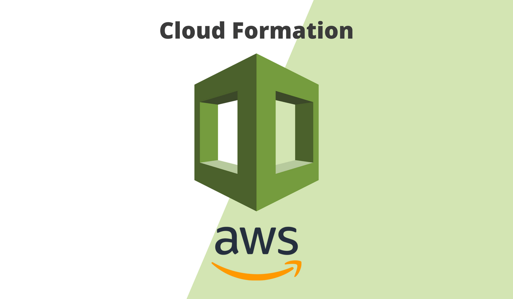
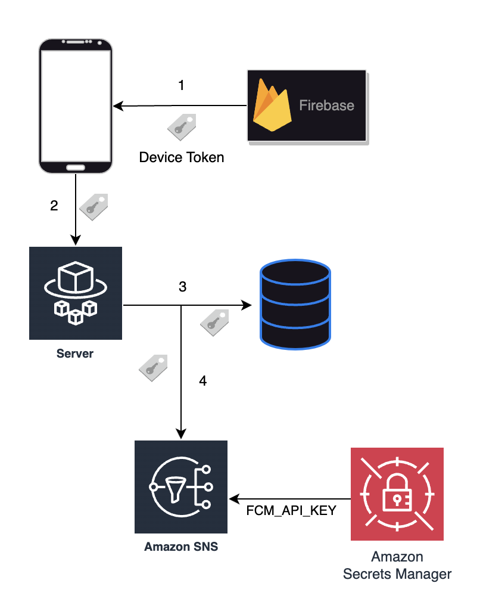
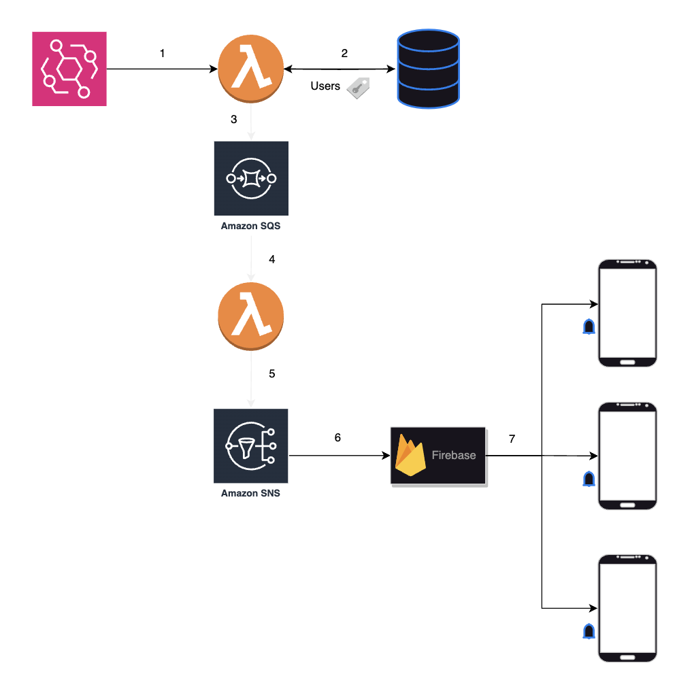

# AWS CloudFormation for Mobile push with FCM

# Architecture

## Generate SNS Platform Endpoint

## Send push notifications

## Summary

Google Firebase Cloud Messaging (FCM) 및 다양한 AWS 서비스(lambda, sns, sqs, eventBridge 등) 을 활용하여 모바일 push 서비스를 구현하기 위한
CloudFormation 예제 템플릿

## How to Deploy

1. **Firebase 설정**
   - Google Firebase에 모바일 앱을 등록하고 FCM API 키를 획득.

2. **AWS Secrets Manager 구성**
   - Secrets Manager 리소스를 생성하고 `FCM_API_KEY` key 에 FCM API 키 값을 value 으로 삽입.

3. **SNS 플랫폼 어플리케이션 배포**
   - Secrets Manager Arn 을 parameter 로 하여 `sns.yaml` CloudFormation 템플릿 배포.

4. **ECS 환경 설정**
   - `sns.yaml` 의 Output 인 SNSPlatformApplicationArn 값을 parameter 로 하여 ECS 의 환경 변수로 배포.
      - 이 때 ECS 에서는 각자의 환경과 쓰임에 따라 디바이스 별 토큰 생성 및 AWS SNS Platform Application 에 토큰과 매핑되는 Platform Application
        Endpoint 를 생성하는 로직이 필요함.

5. **SQS 배포**
   - `sqs.yaml` CloudFormation 템플릿 배포.

6. **Lambda 배포**
   - `sqs.yaml` 의 Output 인 `NotificationQueue`, `NotificationQueueArn` 값을 parameter 로 하여 `lambdas.yaml` CloudFormation
     템플릿 배포.

7. **EventBridge 구성**
   - `lambdas.yaml` 의 Output 인 `FindNotificationUsersLambdaArn`을 parameter 로 하여 `eventBridge.yaml` CloudFormation 템플릿
     배포.

## Warning ⚠️

Lambda 및 ecs 혹은 실행중인 어플리케이션의 세부 구현은 사용방법에 따라 변경해야 함

CodePipeline 을 사용하면, 위 리소스들을 nested stack 으로 하여 자동화 된 배포가 가능함. - [Link](https://www.youtube.com/watch?v=LHz04uN-wI0)
